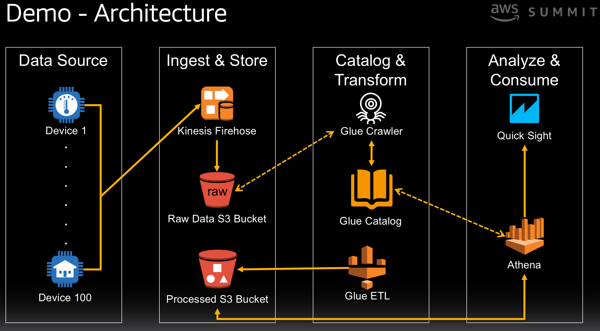
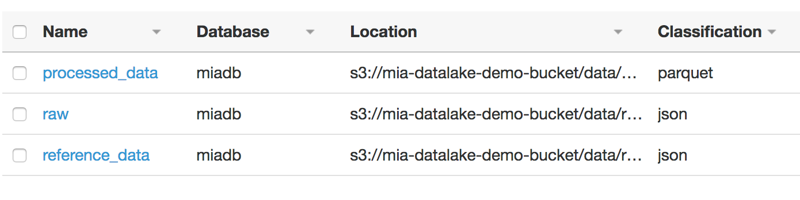
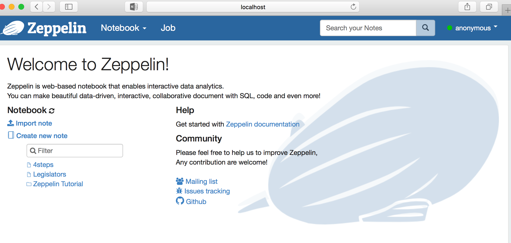

# glue-demo

## 免责申明
建议测试过程中使用此方案，生产环境使用请自行考虑评估。<br>
当您对方案需要进一步的沟通和反馈后，可以联系 nwcd_labs@nwcdcloud.cn 获得更进一步的支持。<br>
欢迎联系参与方案共建和提交方案需求, 也欢迎在 github 项目issue中留言反馈bugs。


## 实验目的
AWS Glue服务大大降低了大数据ETL操作复杂度，有望在19年底前引入国内（本demo目前在美东区域实现）。希望通过这个demo让客户直观的了解glue的使用方法. <br>

## 实验架构


## 实验步骤

### 数据准备
1. 创建S3桶
在us-east-1 创建1个S3桶 mia-datalake-demo-bucket. 在桶里新建/data/reference_data文件夹，放入track-list.json文件。该文件中共100条记录，每条记录格式如下：
```
{"track_id" : "1" , "track_name" : "God's Plan" , "artist_name" : "Drake"}
```

2. 创建kenesis firhose  
在us-east-1 创建1条kinesis firehose stream, destination设为上一步创建的S3桶的data/raw文件夹。  
注意：可以在这里通过一个lambda函数将json格式转化为parquet/orc格式放入S3,提高后续查询效率。

3. 生成实验数据  
通过cloudformation配置cognito:  

https://console.aws.amazon.com/cloudformation/home?region=us-west-2#/stacks/new?stackName=Kinesis-Data-Generator-Cognito-User&templateURL=https://s3-us-west-2.amazonaws.com/kinesis-helpers/cognito-setup.json  

点击KinesisDataGeneratorUrl进入生成器页面,生成json格式数据流。  

在s3的data/raw文件夹下可以看到数据默认以yyyy/mm/dd/hh进行了分区。   


### 数据ETL
1. 创建1个crawler，数据源选择s3://mia-datalake-demo-bucket/data/ .   
crawler可以去爬的数据源包括：s3，jdbc，dynamodb.  

2. 在databses/tables中可以看到爬出的metadata(后两个表),后面在我们的ETL job中会用到这些table.
  


3. 创建一个dev endpoints,即一个glue开发环境。按照操作指引，上传一个ssh public key(可以自己通过keygen 生成).  
endpoints需要5-10分钟的时间ready.   

 ```
 ssh-keygen -t rsa
 ```

4. 在自己的电脑上下载安装zepplin并启动(bin/zeppelin-daemon.sh start), 测试http://localhost:8080 正常打开：
   

5. 通过设置ssh端口转发连接到endpoint背后的EMR集群.
```
ssh -i id_rsa  -NTL 9015:169.254.76.1:9007 glue@ec2-3-80-10-78.compute-1.amazonaws.com
```
6. 新建一个notebook， 开始编写Pyspark代码：
```
%pyspark

import sys
from awsglue.transforms import *
from pyspark.context import SparkContext
from awsglue.context import GlueContext
from awsglue.job import Job
import boto3
import time    


glueContext = GlueContext(SparkContext.getOrCreate())

##使用前面爬出的metadata建立spark的dataframe（这里是glue的dynamic frame)
raw_data = glueContext.create_dynamic_frame.from_catalog(database = "miadb", table_name = "raw")

reference_data = glueContext.create_dynamic_frame.from_catalog(database = "miadb", table_name = "reference_data")

##对2个dynamic_frame进行join操作
joined_data = Join.apply(raw_data,reference_data, 'track_id', 'track_id', transformation_ctx = "joined_data")

##将join后的数据以parquet的格式写到s3
datasink = glueContext.write_dynamic_frame.from_options(frame = joined_data_clean, connection_type = "s3", connection_options = {"path": "s3://mia-datalake-demo-bucket/data/processed-data/"}, format = "parquet", transformation_ctx = "datasink")
```

7. 使用athena 对数据进行即时查询
在glue中的table会自动出现在athena中。但是别忘了，我们前面的etl只是把join后的数据放入s3就完事了，所以join后的metadata在glue中并没有。最快的方法是让glue再对目标文件爬一次就可以了。  
执行查询语句:  

```
select artist_name, count(artist_name) as count
from processed_data group by artist_name order by count desc
```

8. 删除 dev endpoints，否则会持续产生EMR的费用。


## to do list
- 通过api gateway+ lambda 自动生成点击数据流

## 参考资料
- 参照这里的步骤做demo https://unnik.s3.amazonaws.com/public-files/unnik-lab-guides/aws-summit-2018/datalake/unnik-aws-summit-2018-datalake-demo.html#build-a-data-lake-on-aws-in-4-easy-steps
-  在上述基本步骤的基础上，参照这里的描述增加了开发环境环节 https://github.com/awsdocs/aws-glue-developer-guide/blob/master/doc_source/dev-endpoint-tutorial-local-notebook.md  
